# SISBEN Vulnerability Analysis

## Overview

SISBEN Vulnerability Analysis is a web-based analytical platform designed to identify socioeconomic vulnerability profiles in the department of Cundinamarca through the application of data mining and machine learning techniques.

The project was developed using a dataset containing 315,612 SISBEN IV records, allowing the identification of patterns and population segments through clustering and multidimensional analysis. The platform integrates data processing, business intelligence and interactive visualization tools to support data-driven decision-making.

---

## Objectives

* Analyze socioeconomic conditions using SISBEN IV data.
* Identify vulnerability profiles through machine learning techniques.
* Apply data mining methodologies to discover hidden patterns.
* Facilitate the interpretation of results through interactive dashboards.
* Support decision-making based on data analysis.

---

## Dataset

**Source:** SISBEN IV

**Region:** Cundinamarca, Colombia

**Records Analyzed:** 315,612

The dataset contains demographic, social and economic information used to identify patterns associated with vulnerability levels.

---

## Methodology

### Data Preparation

* Data cleaning using Orange Data Mining
* Data transformation
* Feature selection
* Data normalization
* Data quality validation

### Data Mining Techniques

* K-Means Clustering
* Dimensional Analysis
* Multidimensional Data Exploration
* Pattern Identification using Orange Data Mining

### Socioeconomic Analysis

* Multidimensional Poverty Index (MPI/IPM)
* Vulnerability Segmentation
* Cluster Interpretation
* Socioeconomic Pattern Analysis

---

## Technologies Used

### Backend

* Flask
* Python

### Big Data Processing

* PySpark

### Data Mining and Machine Learning

* Orange Data Mining
* K-Means Clustering

### Database

* SQL Server
* Star Schema Data Model

### Data Visualization

* Power BI

### Frontend

* HTML
* CSS

### Version Control

* Git
* GitHub

---

## Features

* Large-scale data processing
* Data cleaning and preprocessing workflows
* Machine learning-based clustering
* K-Means cluster analysis
* Vulnerability profile identification
* Interactive dashboards
* Business intelligence reports
* Socioeconomic segmentation
* Pattern discovery through data mining
* Analytical visualizations

---

## System Architecture

1. Data Extraction
2. Data Cleaning and Preprocessing
3. Data Transformation
4. Machine Learning Processing
5. Vulnerability Analysis
6. Dashboard Visualization
7. Decision Support

---

## Results

The project successfully analyzed more than 315,000 SISBEN IV records and generated socioeconomic vulnerability profiles that facilitate the interpretation of population conditions in Cundinamarca.

The resulting dashboards provide visual and analytical support for identifying population groups with higher vulnerability levels and understanding the factors that influence their socioeconomic conditions.

---

## Screenshots

### Home Page
Landing page of the application, providing access to data analysis, dashboards, and project resources.

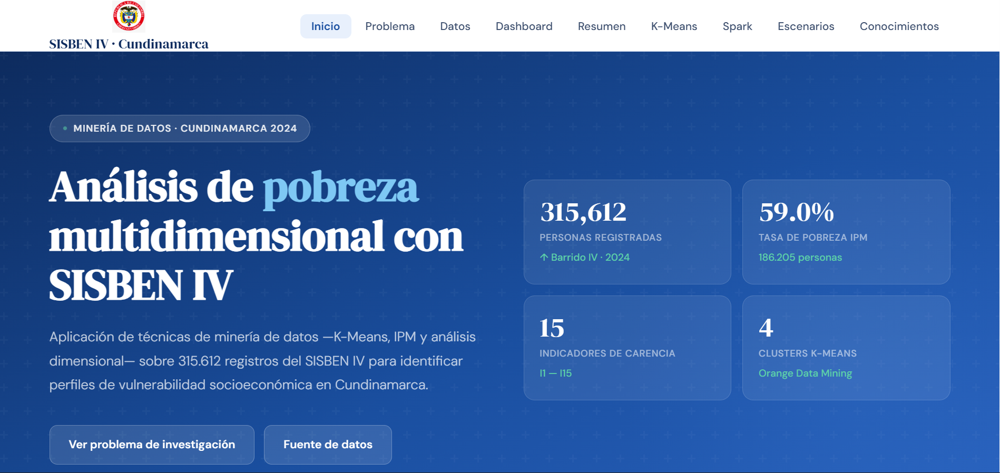

---

### Data Registration Page
Interface used to upload, manage, and validate records before data processing and analysis.

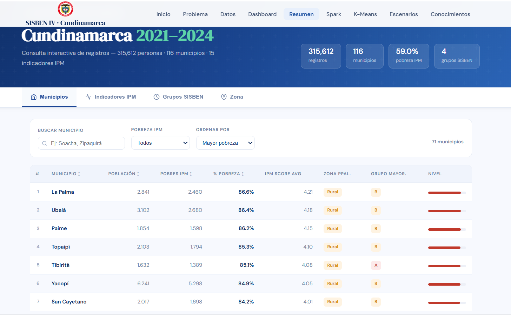

---

### Geographic Distribution Dashboard
Interactive visualization showing the geographic distribution of the analyzed population across different regions and municipalities.

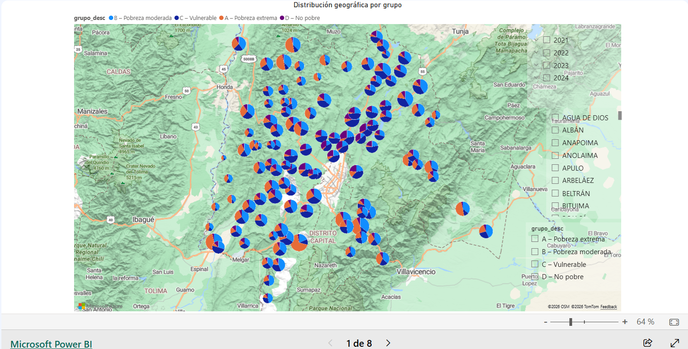

---

### Multidimensional Poverty Index by Region
Dashboard presenting the Multidimensional Poverty Index (MPI) segmented by region to identify disparities and socioeconomic conditions.

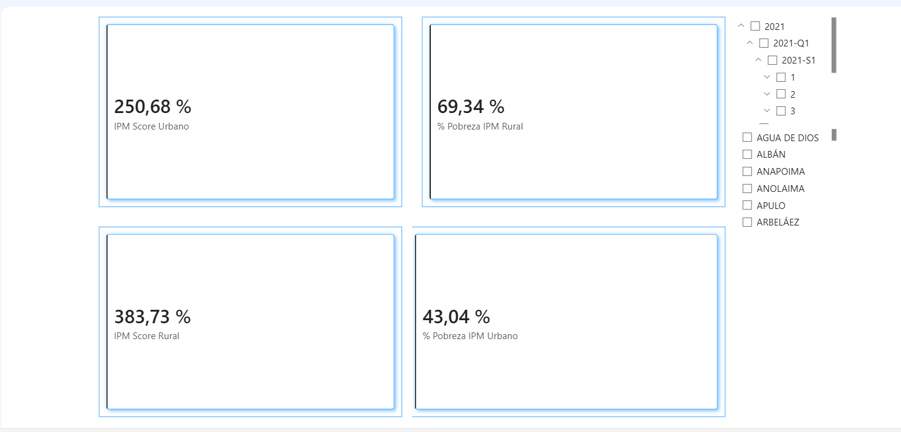

---

### Population by Municipality
Analysis of the total population distribution across municipalities, enabling regional demographic comparisons.

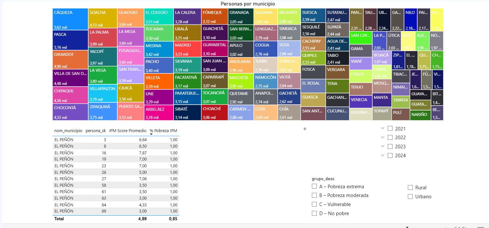

---

### Population Pyramid
Demographic visualization displaying population distribution by age groups and gender.

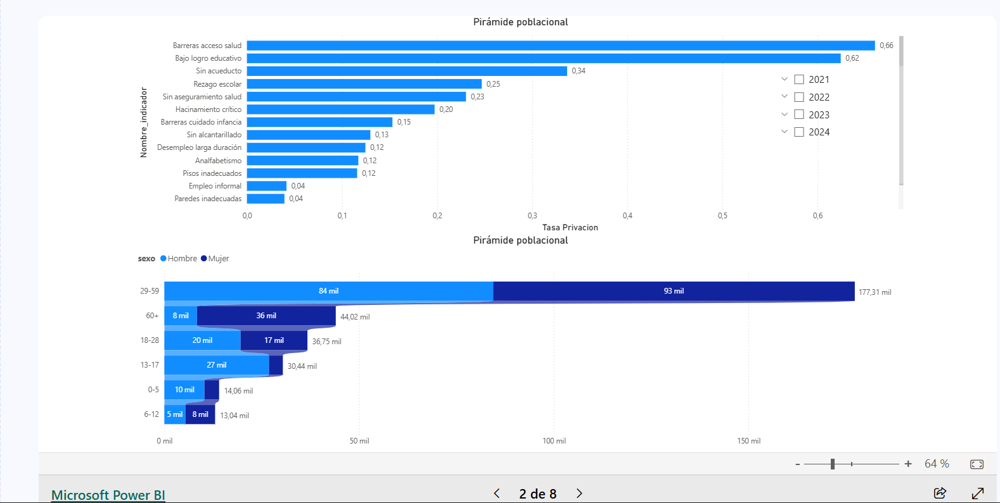

---

### Percentage of People Living in Poverty
Dashboard illustrating the percentage of individuals experiencing multidimensional poverty across the analyzed population.

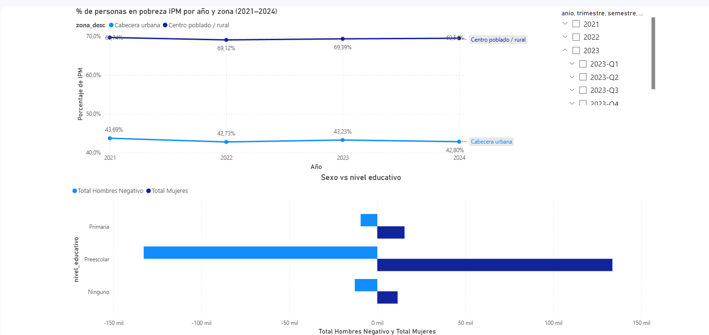

---

### Education Deprivation vs Service Access
Comparative analysis between educational deprivation indicators and access to essential public services.

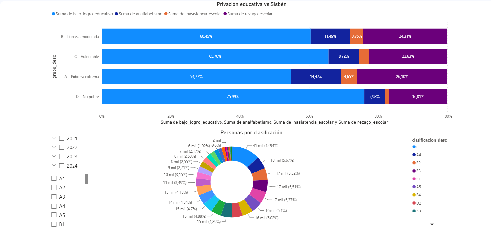

---

### Deprivation by Area and Zone
Visualization of deprivation indicators segmented by urban and rural areas to identify socioeconomic differences.

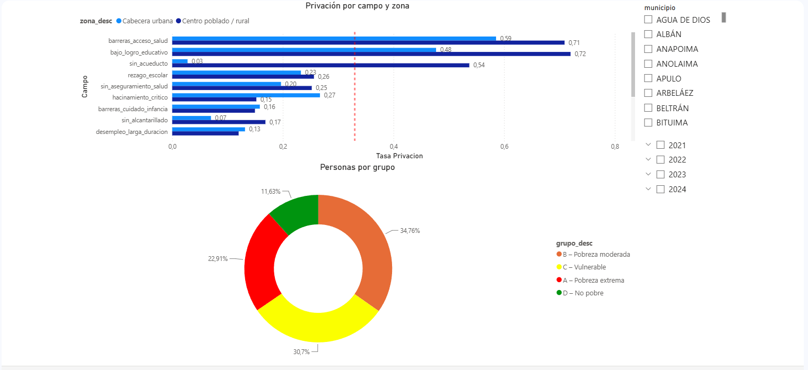

---

### Total Population by Year
Trend analysis showing population changes and growth across different years.

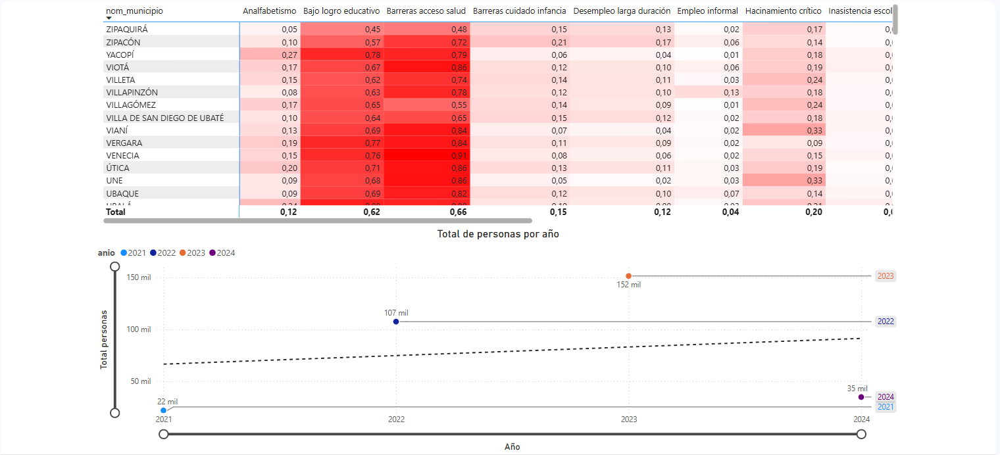

---

### Orange Data Mining Workflow
Workflow developed in Orange Data Mining illustrating the data preparation, transformation, and analysis process.

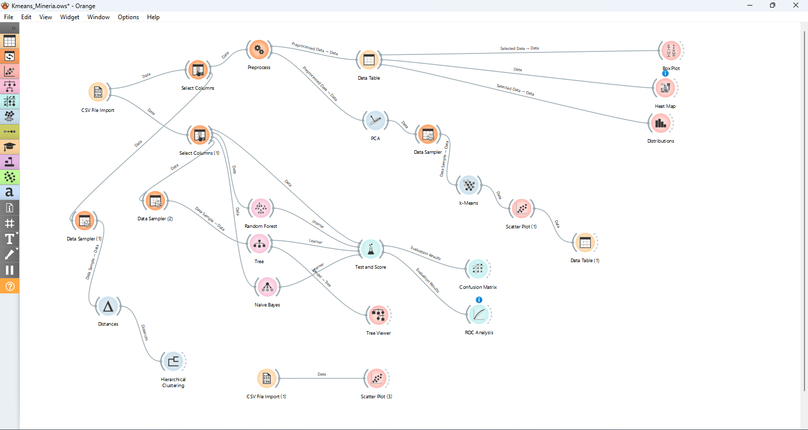

---

### Data Distributions
Distribution analysis of key variables used in the project, providing insights into patterns and data behavior.

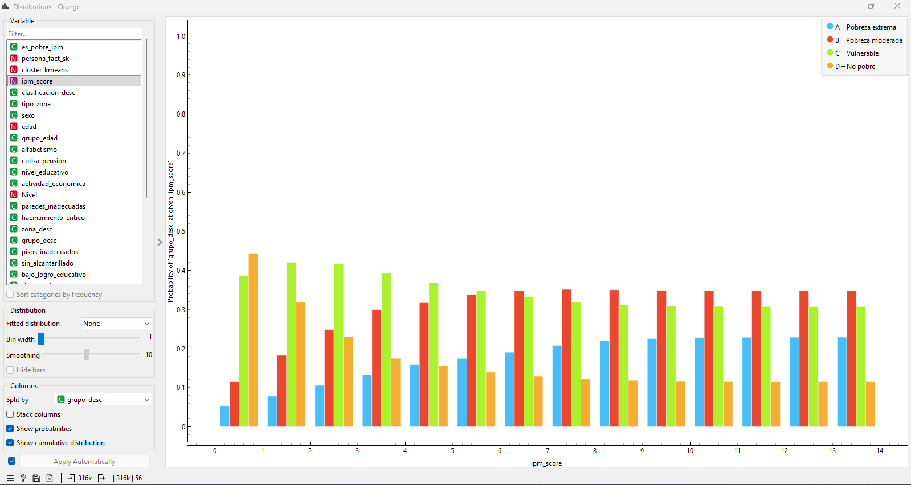

---

### Star Schema Data Model
Dimensional data model designed using a star schema architecture to support analytics and business intelligence processes.

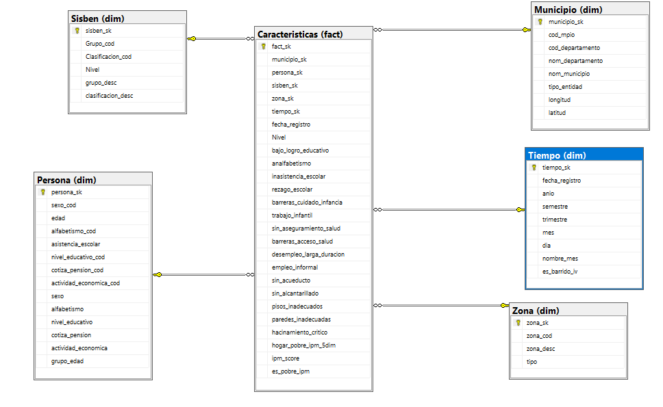

---

### PCA Scatter Plot
Principal Component Analysis (PCA) visualization used to identify patterns, clusters, and dimensionality reduction results.

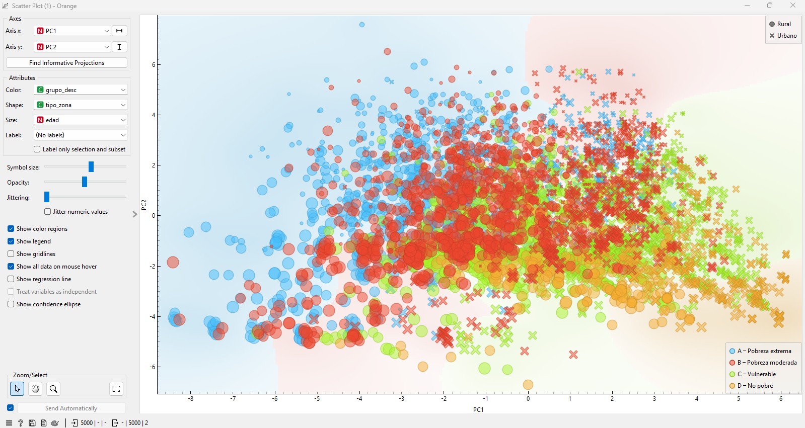

---

### Apache Spark Processing
Implementation of Apache Spark for distributed data processing, transformation, and large-scale analytics.

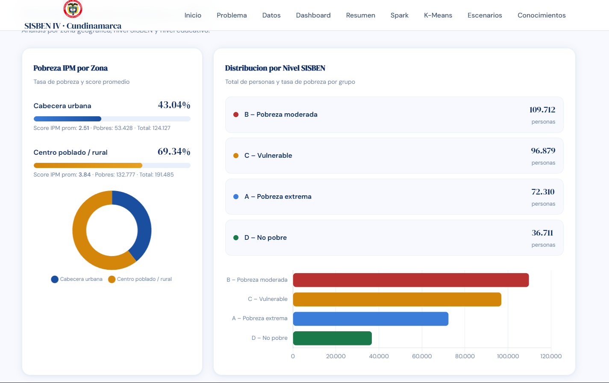

---

## Contributors

### Kevin Steven Ramírez

Project Owner and Lead Developer

### Kevin Alexander Tibaquicha Ortiz

* Project structuring
* Data analysis
* Results interpretation
* Orange Data Mining workflow support
* Collaborative development
* Support in analytical processes

### Yefferson Rivas

* Collaborative development
* Support in data analysis and implementation

---

## Academic Purpose

This project was developed as an academic initiative focused on the application of data mining, machine learning and business intelligence techniques for the analysis of socioeconomic vulnerability using SISBEN IV data.

---

## Repository Structure

```bash
backend/
data/
dashboard/
database/
documentation/
frontend/
README.md
```

---

## License

This project is intended for academic and educational purposes.
